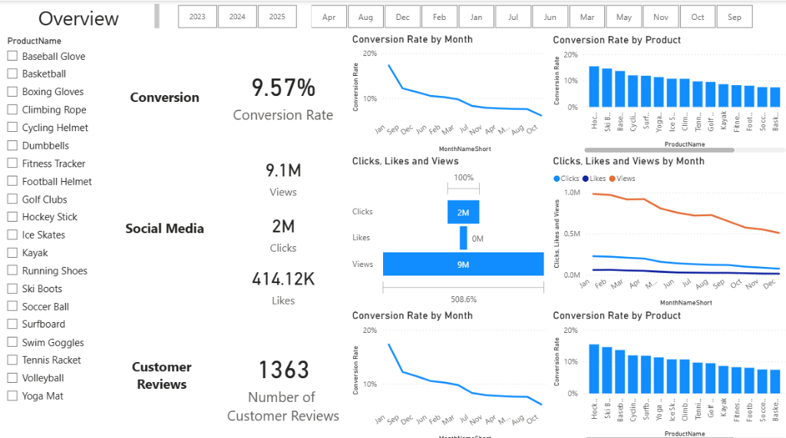
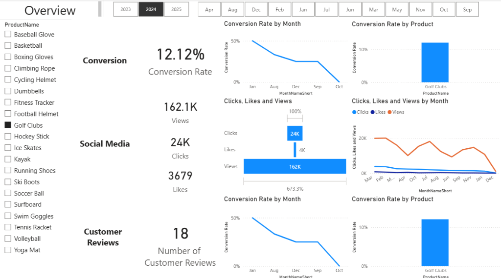
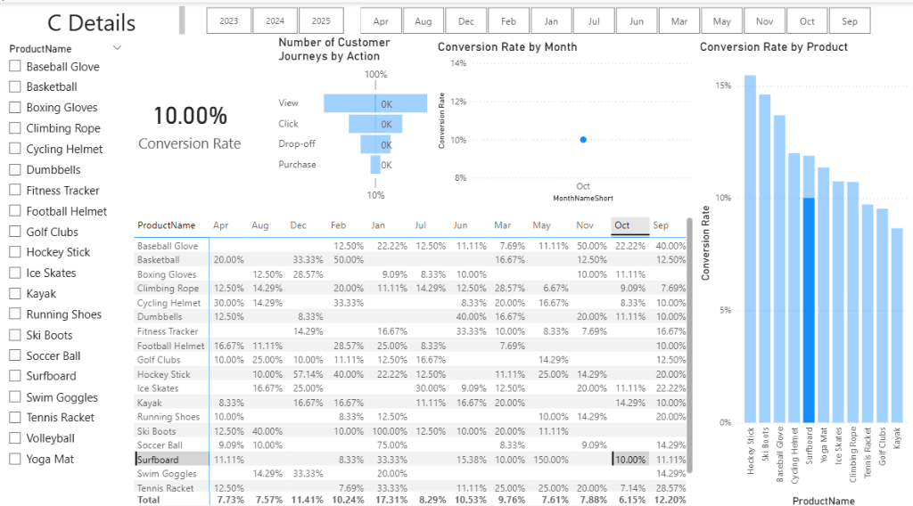
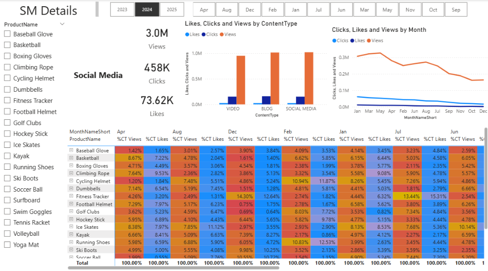
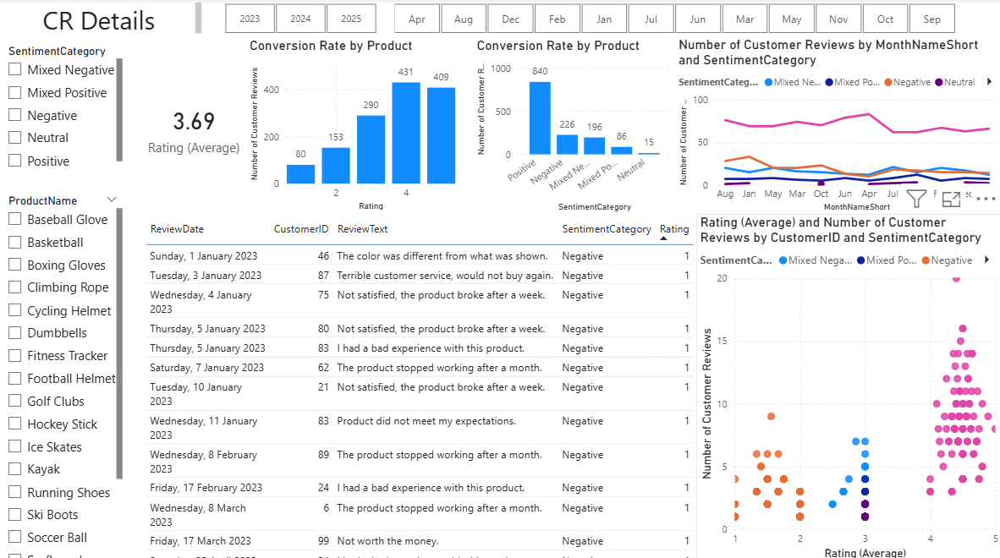

# Marketing Campaign Analysis & Customer Sentiment


## 📌 Project Overview
This project is designed to address the problem of **marketing campaign - customer analysis**, aiming to analyze customer behavior to enhance conversion rates and increase customer satisfaction.

It integrates **SQL for data engineering**, **Python for natural language processing (NLP)**, and **Power BI for visualization** to transform raw engagement and review data into actionable insights for the marketing team.

## 🎯 Business Problem
Marketing teams often struggle to correlate structured engagement metrics (clicks, likes) with unstructured customer feedback (reviews). This project solves that by:
1.  **unifying data sources** to create a single view of the customer journey.
2.  **Quantifying qualitative data** (reviews) using sentiment analysis to measure customer satisfaction trends.
3.  **Visualizing performance** to optimize future marketing spend and content strategies.

## 🔧 Solution Strategy

### 1. Data Engineering (SQL Server)
Raw data from `products`, `customers`, and `engagement_data` tables was cleaned and transformed using advanced SQL techniques:
-   **CTEs & Window Functions**: Used to identify duplicate records and clean Customer Journey paths.
-   **Data Standardization**: Normalized `ContentType` columns (e.g., mapping 'socialmedia', 'Social Media' -> 'SOCIAL MEDIA').
-   **Feature Extraction**: Split combined columns (e.g., `ViewsClicksCombined`) into distinct `Views` and `Clicks` metrics.

### 2. Sentiment Analysis (Python)
Customer reviews were extracted from the database and processed using the **NLTK VADER** library:
-   **Sentiment Scoring**: Calculated compound sentiment scores for every review.
-   **Hybrid Categorization**: Developed a custom logic combining *Sentiment Score* + *Star Rating* to classify reviews as `Positive`, `Negative`, `Mixed Positive`, or `Mixed Negative`.
-   **Bucketing**: Grouped sentiment scores into ranges for easier distribution analysis.

### 3. Interactive Reporting (Power BI)
The dashboard contains **4 specialized reports** designed to address specific marketing business issues:

1.  **Overview**: High-level view of marketing effectiveness, measuring conversion rates and online engagement. Includes interactive controls to filter by Product Name or analyze specific date ranges.
    
    
    

2.  **Conversion Details**: A deep dive into conversion metrics, visualizing the funnel from views to purchases to identify drop-off points.

    

3.  **Social Media Details**: Measurements of social media performance (Views, Clicks, Likes) broken down by content type and channel.

    

4.  **Customer Reviews**: Sentiment analysis of customer feedback, correlating average ratings with text sentiment to pinpoint drivers of customer satisfaction.

    

## 🚀 How to Run

### Prerequisites
-   SQL Server (MSSQL)
-   Python 3.x (libraries: `pandas`, `pyodbc`, `nltk`)
-   Power BI Desktop

### Steps
1.  **Database Setup**: Run `SQL_script/SQL script.sql` to transform and prepare your views/tables.
2.  **Sentiment Analysis**: 
    -   Update the connection string in `sentiment_with_vader/script.py`.
    -   Run the script: `python sentiment_with_vader/script.py`.
    -   This generates `customer_reviews_with_sentiment.csv`.
3.  **Visualization**:
    -   Open `Report.pbix` in Power BI.
    -   Refresh data sources to pull in the latest SQL transformations and the generated CSV.

## 📂 Project Structure
```
├── SQL_script/
│   └── SQL script.sql        # Data transformation & cleaning logic
├── sentiment_with_vader/
│   ├── script.py             # Python sentiment analysis pipeline
│   └── customer_reviews_with_sentiment.csv  # Output dataset
├── Report.pbix               # Power BI Dashboard file
└── README.md                 # Project documentation
```
